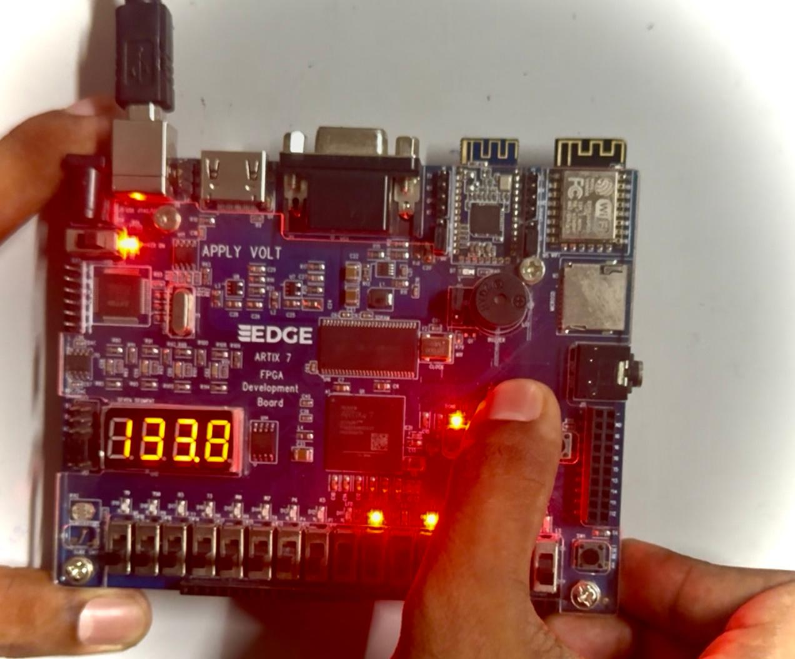
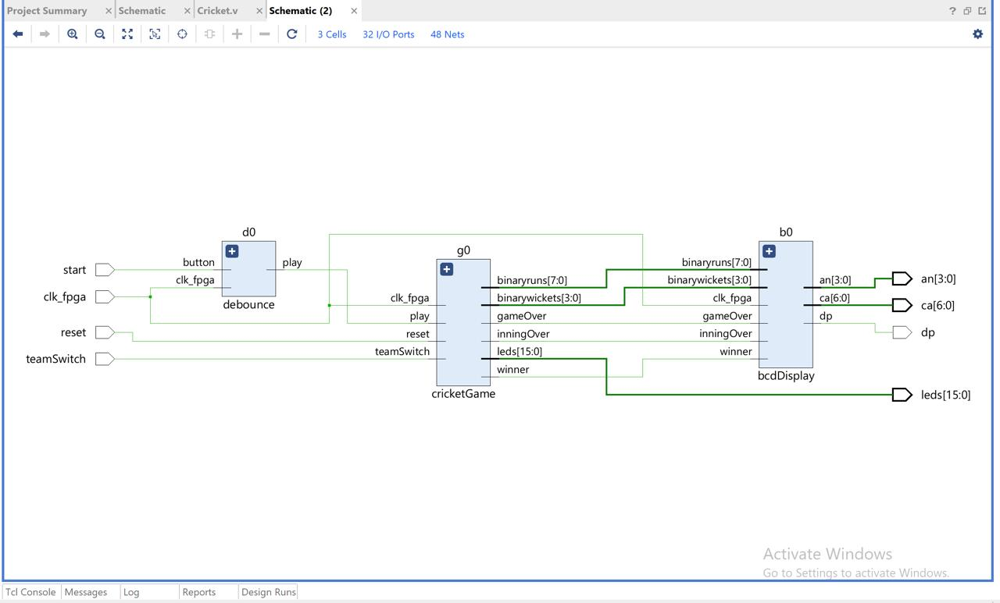

# 🏏 T20 Cricket Game on FPGA (Artix-7 Edge Board)

## 📘 Overview

This project implements a mini T20 cricket game in Verilog on the **Artix-7 Edge FPGA** board. It simulates two batting innings using a pseudo-random LFSR and displays real-time score, overs, and game result using 7-segment displays and LEDs.

---

## 🎯 Features

- 🔁 Random event generation using LFSR
- 🔢 7-Segment display for:
  - Team scores
  - Overs and balls
- 💡 LEDs for:
  - Wickets
  - Overs completion
  - Winning team scroll
- 🔘 Push-button for ball-by-ball control
- ⏱️ Real-time simulation

---

## 🧩 Code Structure

### 🔝 `t20_cricket_game.v` (Top Module)
- Integrates all modules
- Handles user input, score control, and game state transitions

### 📦 Submodules

| File                | Description                                          |
|---------------------|------------------------------------------------------|
| `lfsr.v`            | 8-bit LFSR for random score/wicket generation       |
| `score_manager.v`   | Manages score, wickets, overs, innings, winner      |
| `seven_seg_driver.v`| Converts binary values to 7-segment format          |
| `led_controller.v`  | Controls LEDs for visual result display             |
| `debounce.v`        | Debounces push-button input                         |

---

## 🖥️ Hardware Setup

- **Board**: Artix-7 Edge FPGA  
- **Input**: Push-button (1-bit)
- **Output**:  
  - 7-Segment Displays for score & overs  
  - LEDs for wickets, overs completed, and winner scroll

---

## 🧪 Simulation

- **Tool**: ModelSim / Vivado Simulator
- **Testbench**: `t20_cricket_tb.v`
- Tests:
  - LFSR randomness
  - Game state transitions
  - Winner declaration logic

---

## 📸 Visuals

### 🔋 Score Generator

### 🔁 Game Flow

### 📐 Elaborated RTL Design

---

## ▶️ Run Instructions

1. Open project in **Vivado 2020.2+**
2. Synthesize and Implement the design
3. Generate Bitstream and program to FPGA
4. Press the push-button for each delivery
5. Monitor:
   - Score and overs on 7-segment displays
   - Wickets, innings, and result via LEDs

---

## 🎥 Demo Video

📺 [Watch on YouTube](https://youtu.be/kWOw-FWc5Vg?si=2BD5atmlYgCtzvvv)

---

## 🚀 Future Enhancements

- Simulate bowler variations
- Add over countdown timer
- Use UART/OLED for commentary and score stats

---

## 👤 Author

**T. Obul Sai**  
ECE 4th Year, RGUKT RK Valley  
🔗 GitHub: [obulsai](https://github.com/obulsai)  
📹 Project Demo: [YouTube](https://youtu.be/kWOw-FWc5Vg?si=2BD5atmlYgCtzvvv)
